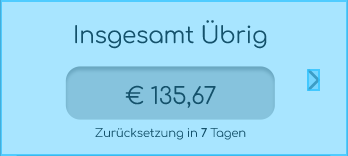
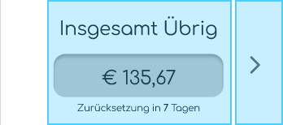
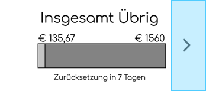
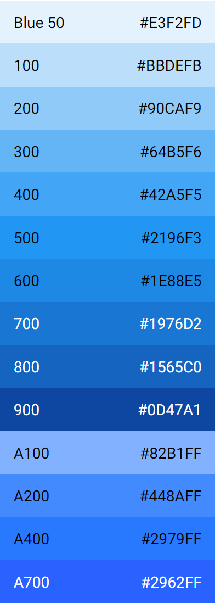

# Low-Fidelity Prototyp

## Allgemeines
Der Lo-Fi Prototyp wurde mit  [Figma](https://www.figma.com/ "Figma's Homepage") erstellt.

Hier ist der Link, um den Prototypen selbst aufzurufen: [Low Fidelity Prototyp](https://www.figma.com/proto/FgMPlzpcNq7p4y9uxPL896/Budget-Binder-Lofi?node-id=1%3A122&scaling=scale-down&page-id=0%3A1&starting-point-node-id=1%3A122&hide-ui=1 "Low Fidelity Prototyp")

## Funktionen des Lo-Fi Prototypen
Für den Lo-Fi sind nur wichtige Kern-Features vonnöten, deshalb besteht der Lo-Fi aus folgenden
Features:
- Anmeldung / Registrierung
- Übersichtsmenü des Budgets
  - Übriges Budget der jeweiligen Kategorien (+ insgesamt)
  - Letzte Einträge 
- Erstellen eines neuen Eintrags (Einnahmen/Ausgabe)
  - Kategorie
  - Name
  - Menge
  - Wiederholung (Am ersten Tag des Monats)
- Erstellen von neuen Kategorien
  - Bild
  - Name
  - Monatliches Budget

## Designentscheidungen
Das Startmenü dient zur leichten Übersicht des eigenen Budgets. Wir schwanken für die Anzeige des übrigen Budgets zwischen puren Zahlen und Tortendiagramm. Hierbei werden die User Tests ausschlaggebend für die spätere Umsetzung sein.

Wir haben uns für Kategorie-Icons entschieden, damit die Kategorien auf einen Blick leicht zu unterscheiden sind, wenn man sie miteinander vergleicht.

## Usability Testing 
Um unseren Prototypen sinnvoll zu testen haben wir uns eine Liste an Aufgaben und Fragen überlegt, die von externen Personen gelöst und beantwortet werden sollen. Die von uns überlegten Aufgaben und Fragen findet man unter Die dazugehörigen Tests findet man unter Anhand der von uns durchgeführten Tests sind wir zu den folgend genannten Änderungen gekommen.

## Designänderungen durch den User Test
Anhand der dritten Aufgabe _"Schaue nach, wie viel Budget Kategorie 2 insgesamt hat."_ sind uns viele Dinge aufgefallen, die wir dringend abändern müssen. Daraus resultierende Änderungen sind in Änderung 1 und 2 zu finden. 
Wir haben uns dank des LoFi User Tests auch für eine feste Farbpalette entschieden (Änderung 3).

### Änderung 1:

| Vorher | Nachher |
| --- | --- |
|  |  |

**Problem:** 
- Die Pfeilhitbox zum Wechseln der Bildschirme ist zu klein, wodurch Verwirrung zwischen den Mechaniken "Pfeilklick wechselt zur nächsten Kategorie" und "Klick auf die Kategorie wechselt die Ansicht" entstanden ist. Dazu ist die Hitbox zum Wechseln auch hinter dem Knopf, was beim verklicken die Ansicht gewechselt hat, anstatt die Kategorie zu wechseln. Da die Probanden aber gedacht haben, dass sie den Knopf drückten, waren sie nur verwirrt von der falschen Aktion.

**Lösung:**
- Wir passen die Hitboxen an, sodass man besser den Pfeil treffen kann. Dazu wird fürs Erste die Hitbox zum Ändern der Ansicht auch limitiert auf die nur wirkliche Fläche.

### Änderung 2:
| Vorher | Nachher |
| --- | --- |
|  |  |
**Problem**
- Beim Ändern der Kategorie und wechseln der Ansichtsart hat jeder der 5 Probanden zuerst das Hamburger-Menü geöffnet in der Hoffnung, dort das zu finden, was sie suchen. Die Finanzübersicht mit der Wechselmechanik ist zu Nutzer-unfreundlich 

**Lösung**
- Umgestaltung der Finanzübersicht und Wechselmechanik. Da wir mit so dieses potenzielle Problem voraussahen, haben wir Frage 1 darauf gerichtet, wie die Finanzübersicht am besten aussehen sollte. Aus den Antworten ergibt sich, dass Ansicht 4 (Balkenansicht) am besten als Finanzübersicht eignet. Daraus folgend entfernen wir auch die Wechselmechanik, da diese wie in Änderung 1 erklärt nur für Verwirrung sorgt.

### Änderung 3:
| Nachher |
| --- | 
|

**Problem**
- Es ist nicht klar mit welchen Farben wir unsere App gestalten sollten, weshalb wir Frage 2 stellten, in der zwischen einer Blau/Lila und Grünen Farbpalette entschieden werden musste.
- **Lösung**
- Jeder fand die blaue Farbpalette passender für etwas Finanzorientierter, doch durch vermehrte Anmerkung, dass lila zu viel sei, haben wir vom Blau/Lila weg entschieden, sondern uns für [Material Designs](https://material.io/) "Blue 50" Farbpalette entschieden.

