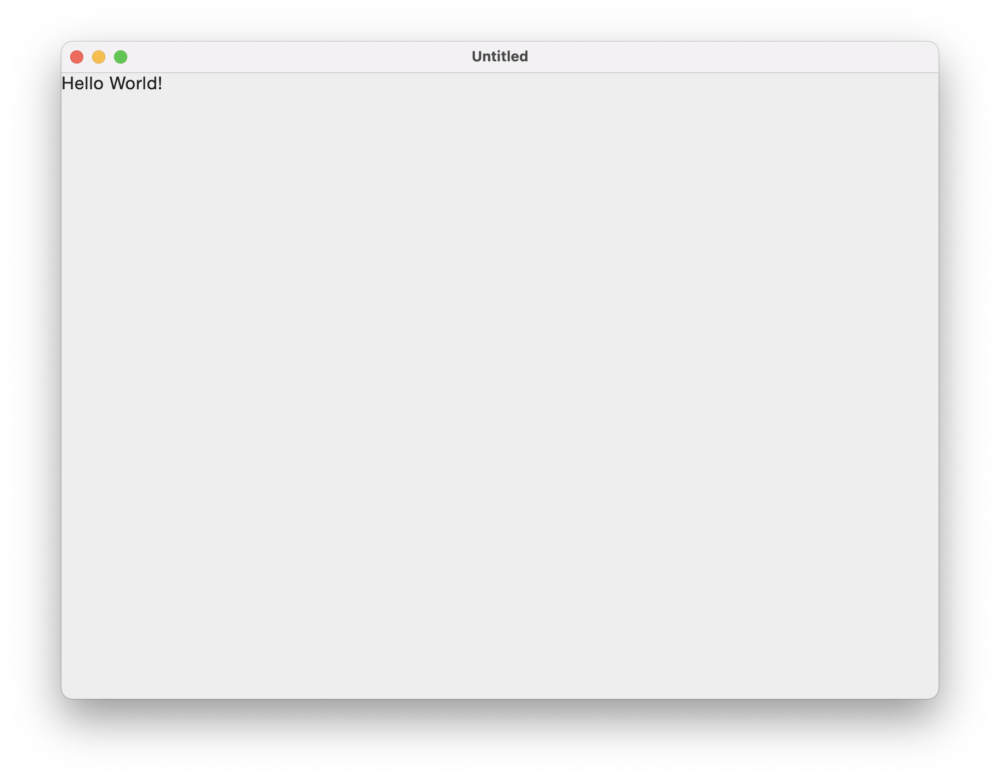
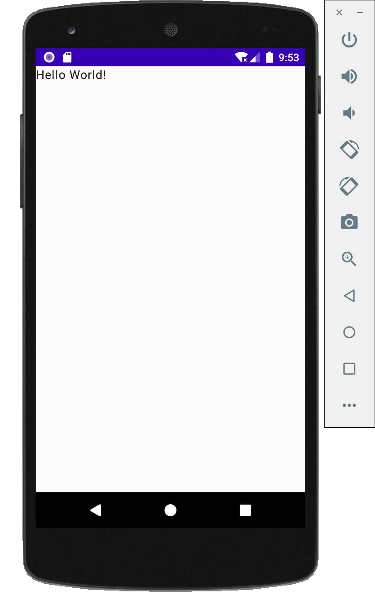
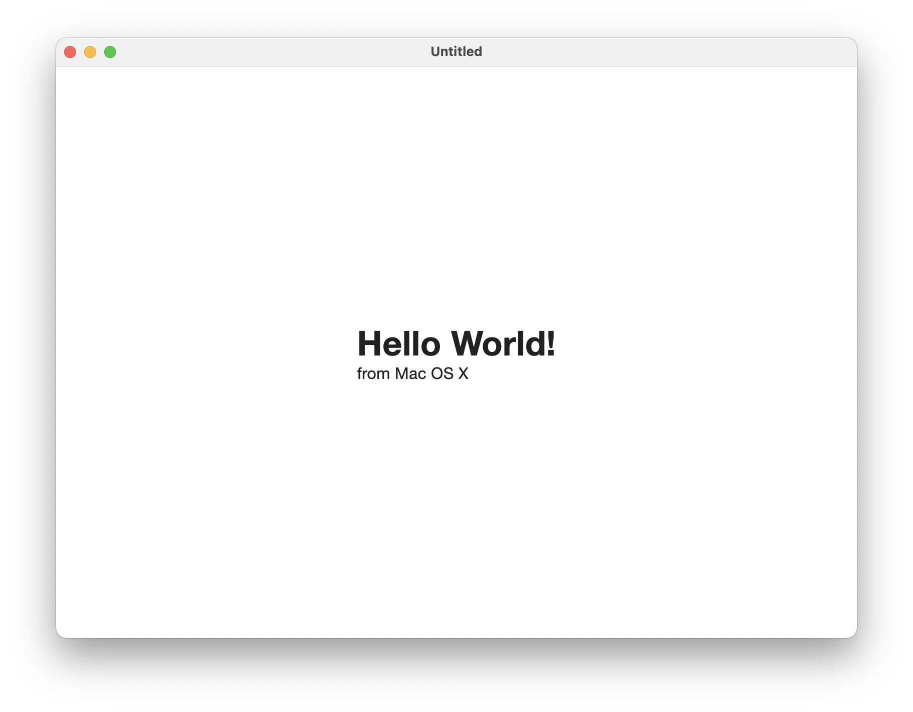
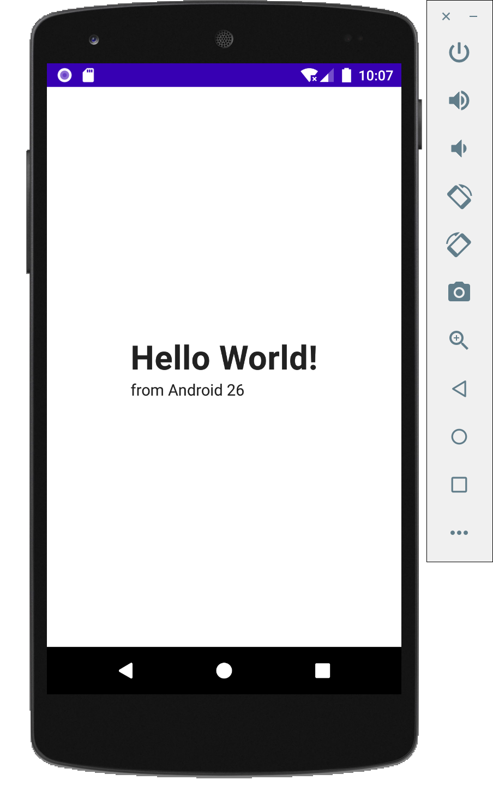
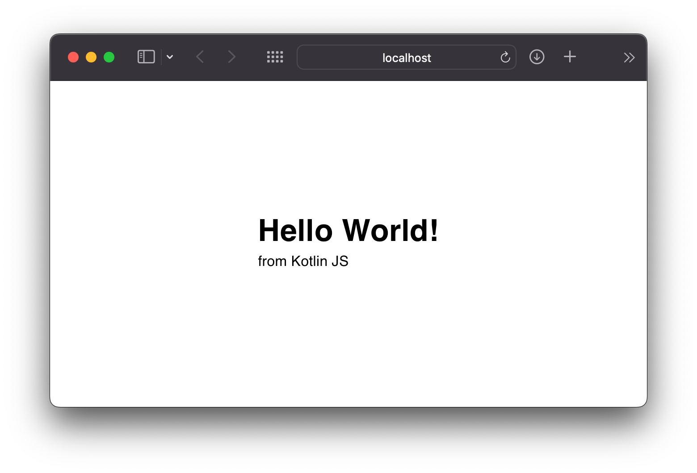
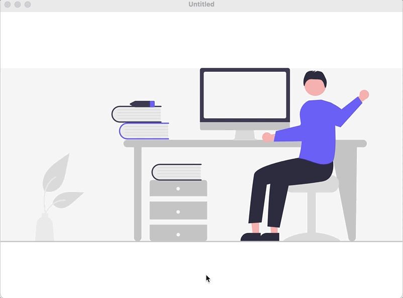
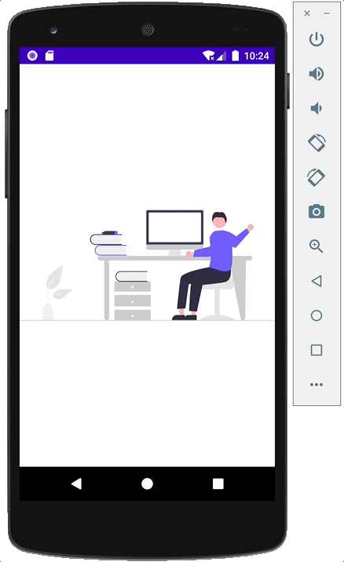
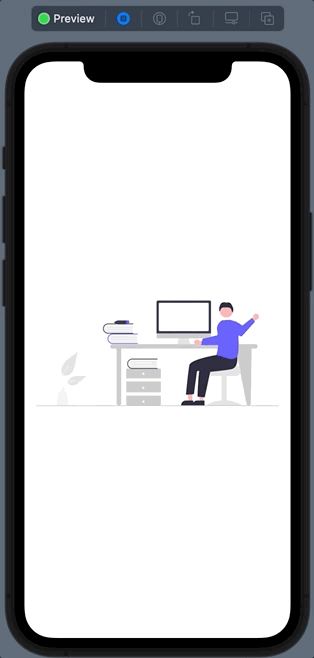
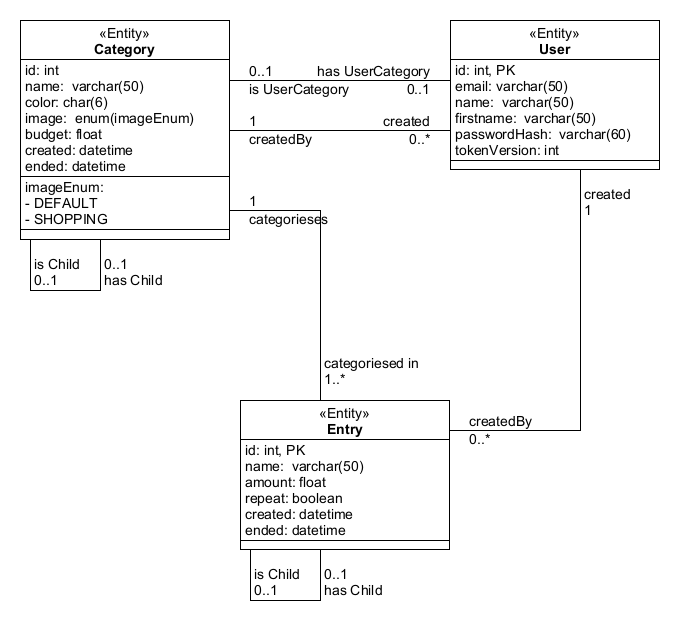

# Fortschritt

## Meilenstein 1 - bis 29.04.2022
- [ ] Multiplatform Compose ready
- [ ] Ktor Client + Server aufbauen
- [ ] Ui/Ux Design
    - [ ] LoFi wurde erstellt
    - [ ] HiFi wurde erstellt
    - [ ] Usertest wurden durchgeführt

### Multiplatform Compose ready
**Ziel:** Compose Multiplatform ist auf allen Endgeräten **(Desktop, Web, Android, iOS)** verfügbar mit einer einfachen **Hello World** Anwendung.

#### 04.04.2022
Es wurde angefangen, die Projektstruktur aufzubauen. Dabei ist ein Hauptprojekt (`budget-binder`) mit zwei Unterprojekten (`budget-binder-common` und `budget-binder-multiplatform-app`) entstanden. Die Anwendung laufen aktuell, breits schon mit Compose, auf **Desktop** und **Android**.

| Desktop                                            | Android                                            |
|----------------------------------------------------|----------------------------------------------------|
|  |  |

#### 05.04.2022
Die Webanwendung wurde hinzugefügt und mit Compose ein anderes **"Hello World"** Design eingeführt. Zudem wurden Platform Abhängige eigenschaften (wie z.B. der Name der Platform) mittels der Logik `expect` und `actual` eingeführt.

**budget-binder-common/src/commonMain/...**
```kotlin
expect class Platform() {
    val platform: String
}
```

**budget-binder-common/src/androidMain/...**
```kotlin
actual class Platform actual constructor() {
    actual val platform: String = "Android ${android.os.Build.VERSION.SDK_INT}"
}
```

| Desktop                                            | Android                                            | Web                                        |
|----------------------------------------------------|----------------------------------------------------|--------------------------------------------|
|  |  |  |

#### 06.04.2022
Das Projekt ist verfügbar für die Endgeräte **Desktop, Android, Web**, mit **iOS** bestehen noch Probleme. Es wurde sich mit Compose (theoretisch auch mit `swiftUI` für das Frontend für iOS) genauer auseinandergesetzt und versucht Xcode mit Kotlin Multiplatform zu verbinden. Für Compose für Desktop und Android wurden Animationen erstellt und Bilder in die UI geladen.

| Desktop                                                     | Android                                                     | iOS (nur UI)                                        |
|-------------------------------------------------------------|-------------------------------------------------------------|-----------------------------------------------------|
|  |  |  |

### Ui/Ux Design

#### LoFi
**Ziel:** Der Lofi wurde erstellt

#### HiFi
**Ziel:** Der HiFi wurde erstellt

#### Usertest
**Ziel:** Usertests wurden durchgeführt

## Meileinstein 2 - bis 20.05.2022
- [x] Datenmodelle definieren
- [x] Schnittstelle definieren
- [x] REST API bauen
    - [x] REST API testen
- [ ] Fontend Design entwicklung starten
- [ ] Dokumentation starten

### Datenmodelle definieren
**Ziel:** Ein UML-Diagramm mit dem Datenmodell erstellen

### 02.05.
Es wurde in der gesamten Gruppe diskutiert, wie unser Datenmodell aussehen soll.
Zuerst haben wir die grundsätzlichen Felder besprochen. Dann haben wir definiert, dass es wiederholende Einträge gibt. 
Es wurde entschieden, das man in unserer App in die Vergangenheit gucken kann und demnach brauchen wir eine Versionierung von wiederholenden Einträgen und Kategorien, was wir durch eine Parent-Child Beziehung abgebildet haben.
Nach der Besprechung wurde folgendes UML-Diagram abgefertigt.


### Schnittstelle definieren
**Ziel:** 

### 02.05.
Es wurde in der gesamten Gruppe diskutiert, wie unsere Schnittstellen aussehen sollen.
Und wir sind zu folgendem Ergebnis gekommen:
```
# All Query Params are optional
GET /entries?current=true&perdiod="MM-YYYY"
POST /entries

GET /entries/{entryId}
PATCH /entries/{entryId}
DELETE /entries/{entryId}

GET /categories?current=true&perdiod="MM-YYYY"
POST /categories

GET /categories{categoryID}
PATCH /categories{categoryID}
DELETE /categories{categoryID}

GET /categories{categoryID}/entries

GET /me
PATCH /me
DELETE /me

POST /register
POST /login
```

### REST API bauen
**Ziel:** Budget-Binder-Server als RESTApi implementieren, die Datenmodelle verwenden und die Schnittstellen als Endpunkte erstellen.

### 15.04.
Das Serverprojekt wurde angelegt und eine erste Implementation des Ktor-Servers erstellt.
Dann wurde ein Dockerfile erstellt, um den Server so auf jeglichen Linux-Servern starten zu können. 

### 21.04.
Es wurde eine erste Projektstruktur aufgebaut. Zudem wurde Jetbrains/Exposed hinzugefügt und eine erste Version eines Users als Schema definiert.

### 22.04.
Man kann sich nun zwischen einer SQLITE, MYSQL und POSTGRES Datenbank entscheiden, indem man die nötigen ENV-Variablen setzt.
Passwörter werden jetzt mit bcrypt gehasht.
Weiterhin wurde die Möglichkeit geschaffen sich mit Username und Passwort zu authentifizieren, indem die Daten mit der Datenbank verglichen werden 
oder mit JWT (JSON-Web-Tokens), welchen man beim Login erhält. 
Es wurden zwei DTOs (Data-Transfer-Objects) in budget-binder-common definiert, die zwischen Server und Client ausgetauscht werden.
Der Endpunkt zum Einloggen wurde definiert der einen JWT für die Authentifizierung schickt, welcher 15min hält, und ein Refresh-Cookie, um sich beim Endpunkt /refresh_token einen neuen Access-Token zu erhalten.

### 23.04.
Eine erste README für den Server erstellt und einige Zeit damit verbracht mithilfe einer TestWebseite CORS richtig zu definieren.
Zudem wurde die Möglichkeit geschaffen über die Config zu definieren, wie lange die jeweiligen JWT für Access und Refresh gültig sind.
Zum Schluss wurde die token-Version dem User als neues Feld hinzugefügt, um zu überprüfen, ob der aktuelle Token noch gültig ist, den der User mitgeschickt hat.

### 24.04.
Es wurde die Klasse JWT-Service erstellt in die alle Funktion für JWT aus den Routen /login und /refresh_token verschoben wurden.
Zudem wurde eine neue Authentifizierung für Admins hinzugefügt.

### 25.04.
Es wurde das Plugin CallLogging zu Ktor hinzugefügt, um über das aktuelle Logging-System auch alle Anfragen an den Server sehen zu können.
Des Weiteren wurden weitere Endpunkte zum Registrieren eines Benutzers, zum Erhalten einer Liste aller Benutzer und zum ausloggen implementiert.

### 26.04.
Es wurden weitere Endpunkte zum Bearbeiten und löschen von Benutzern erstellt.
Des Weiteren wurde eine openapi.yaml und openapi.json erstellt, welche die RESTApi beschreiben.
Zudem wurden der Endpunkt /openapi.json erstellt, der diese Datei bereitstellt, und /docs, welche ein HTML-Dokument mit der Swagger-UI zur Verfügung stellt.

### 28.04.
Alle Endpunkte senden nun nur noch HTTP-Method 200(OK) mit einem möglichen Error in der Antwort oder 401(Unauthorized).

### 02.05.
Nach einer Gruppenbesprechung wurde entschieden, das wir keinen Admin-Benutzer benötigen, dies wurde umgesetzt und alle Endpunkte, die nur Admin nutzen konnte, wurden entfernt.
Die Routen für docs wurden in eine eigene Datei gepackt.

### 06.05.
Die Datenbank-Modelle wurden auf Basis des UML-Diagramms erstellt.
Zudem wurden die dazugehörigen DTOs erstellt und die Definition dieser in die openapi.json hinzugefügt.
Jeder User erhält beim Registrieren eine UserCategory, welche im Frontend als "Keine Kategorie" angezeigt werden soll.
Diese Kategorie kann nicht verändert oder gelöscht werden und alle Entries werden dieser Kategorie hinzugefügt, wenn keine spezielle angegeben wurde.
Für CORS wurde die Möglichkeit hinzugefügt, mehrere Frontend-Adressen anzugeben.

### 07.05.
Es wurde ein neuer Endpunkt /favicon.ico erstellt, welcher unser neues icon zurückgibt.

### 09.05.
Die Eltern-Kind-Beziehung der Kategorien und Einträge wurde implementiert und bei der Erstellung der DTOs berücksichtigt.
Es wurde die Möglichkeit hinzugefügt, den Server über https erreichbar zu machen.
Das XForwardHeaderSupport Plugin wurde hinzugefügt, um https-cookies über einen reverse-Proxy zu verschicken.

### 11.05.
Das Package CliKt wurde hinzugefügt, um Programm-Parameter zu parsen.
Dies wird genutzt, um eine configFile beim start zu übergeben.
Es wurde eine Config- und eine ConfigIntermediate-Klasse erstellt.
Das Package Hoplite wurde hinzugefügt, um eine Yaml-Datei in eine DataClass umzuwandeln in diesem Fall die ConfigIntermediate-Klasse.
Die ENV-Variablen werden auch zur ConfigIntermediate-Klasse umgewandelt und anschließend daraus eine Config erstellt.

### 12.05.
Beim start wird nun die Config erstellt und an das mainModule weitergegeben und von dort durch Kodein für alle zur Verfügung gestellt.
Das Logging wurde verbessert, indem die logback.xml angepasst wurde.

### 13.05.
Es wurde eine neue Abstraktionsebene erschaffen, die eine Alternative zur Datenbankanbindung ermöglicht. 
Dazu wurden Interfaces erstellt und die derzeitige Implementation an diese angepasst.
Zudem wurde eine Basis-Implementation der Entries und Categories erstellt, die dann inkrementell verbessert wird.

### 17.05.
Es wurde eine erste Version der Versionierung von Entries und Categories implementiert.
Alte Kategorien und Einträge können nicht mehr verändert oder gelöscht werden.
Die Query-Parameter current und period werden nun nicht mehr ignoriert, sondern es werden nur noch Kategorien und Einträge gesendet, die in der angegebenen Periode sind.
Einträge werden in die richtige Kategorie gepackt, wenn die vorherige Kategorie verändert wird.

### 19.05.
Es wurde versucht ein eigenes Plugin zu entwickeln bis aufgefallen ist, das ein bereits vorhandenes Plugin dies bereits unterstützt.
Das Plugin StatusPages wurde dafür genutzt bei 401 auch ein Objekt mit einer Error-Message zu verschicken.

### 23.05.
/logout schickt nun auch eine APIResponse, wobei nun jede Anfrage an den Server auf die eine Antwort mit 200 oder 401 folgt, eine APIResponse erhält.
Logging wird jetzt auch zu einer Datei hinzugefügt und nicht mehr nur auf StdOut.
Es wurde von der Ktor version 1.6.8 auf ktor version 2.0.1 migriert.

### 25.05.
die openapi.json und openapi.yaml wurden auf den neuesten Stand gebracht.
die Endpunkte /openapi.json und favicon.ico wurde durch ein static-folder ersetzt.
In diesem Ordner werden alle Dateien automatisch zur Verfügung gestellt.
Dies wird zudem genutzt, um den JS-Client über den Server zur Verfügung zu stellen.
Zudem wurden die Dockerfiles angepasst, um zusätzlich den JS-Client dem Server hinzuzufügen. 

### 27.05.
die frontend-Adressen werden nun in der Config als Array angegeben und nicht nur als String.
die Readme wurde auf den neuesten Stand gebracht.

#### REST API Testen
**Ziel:** Für alle Endpunkte der REST-Api Tests schreiben, um die Richtigkeit der Implementation zu testen.

### 12.05.
Die Basis für alle kommenden Tests geschaffen und der erste funktionierende Test erstellt.

### 17.05.
Ein Test wurde erstellt, um /login und /logout zu testen

### 18.05.
Es wurde eine logback-test.xml erstellt, um das logging bei tests zu deaktivieren.
Ein neuer Test zum Überprüfen der User-Endpunkte wurde erstellt.
Der Anfang für Kategorie Tests wurde erstellt.

### 19.05.
Die Tests für alle Kategorien und Kategorie für die gegebene ID wurden hinzugefügt.
Des Weiteren wurden nicht implementierte Tests für die Einträge hinzugefügt.

### 20.05. und 21.05.
Es wurden die restlichen Tests hinzugefügt, um alle eigenarten bezüglich der Versionierung zu testen und Fehler abzufangen.

### 23.05.
alle tests wurden von ktor version 1.6.8 auf 2.0.1 migriert

### Frontend Design entwicklung starten
**Ziel:** 

### Dokumentation starten
**Ziel:** 

## Meilenstein 3 - bis 20.06.2022
- [ ] Web Frontend fertigstellen
- [ ] Desktop Frontend fertigstellen
- [ ] Android Frontend fertigstellen
- [ ] iOS Frontend fertigstellen
- [ ] Frontend Usertests
- [ ] Dokumentation fertigstellen
