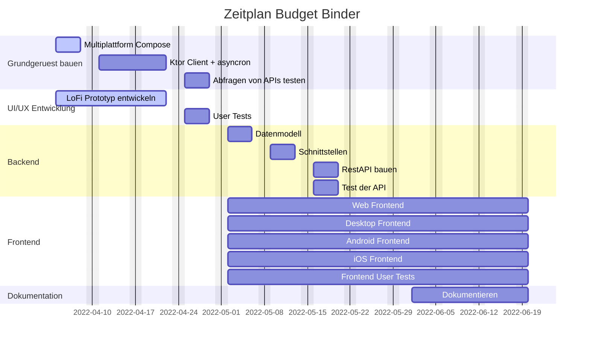

# Zeitplan
**Deadline: 20.06.2022**

```mermaid
gantt
    title Zeitplan Budget Binder
    dateFormat  YYYY-MM-DD
    excludes    weekends

    section Grundgeruest bauen
        Multiplattform Compose                      :active, 2022-04-04, 2022-04-08
        Ktor Client + asyncron                      :2022-04-11, 2022-04-22
        Abfragen von APIs testen                    :2022-04-25, 2022-04-29
    section UI/UX Entwicklung
        LoFi Prototyp entwickeln                    :active, 2022-04-04, 2022-04-22
        User Tests                                  :2022-04-25, 2022-04-29
    section Backend
        Datenmodell                                 :2022-05-02, 2022-05-06
        Schnittstellen                              :2022-05-09, 2022-05-13
        RestAPI bauen                               :2022-05-16, 2022-05-20
        Test der API                                :2022-05-16, 2022-05-20
    section Frontend
        Web Frontend                                :2022-05-02, 2022-06-20
        Desktop Frontend                            :2022-05-02, 2022-06-20
        Android Frontend                            :2022-05-02, 2022-06-20
        iOS Frontend                                :2022-05-02, 2022-06-20
        Frontend User Tests                         :2022-05-02, 2022-06-20
    section Dokumentation
        Dokumentieren                               :2022-06-01, 2022-06-20
```
