# Low-Fidelity Prototyp Test

## Allgemeines
Dieses Dokument beinhaltet die Aufgaben und Fragen für den Low-Fidelity Prototyp-Tests.

## Projektbeschreibung
(Vor dem Durchführen der Tests erstmal das Projekt erklären) 
Bei unserem Projekt handelt es sich um ein digitales Haushaltsbuch, um seine Finanzen schnell von überall auf den Blick zu haben.

## Aufgaben
| Aufgabe | Beschreibung | Flow Startpunkt|
|---|----------------------------------------|-----------|
| 1 | Gib deine Daten ein und melde dich an   |'Anmeldung'| 
| 2 | Erstelle einen neuen Eintrag           |'Hauptmenü'|
| 3 | Schau nach, wie viel Budget Kategorie 2 insgesamt hat |'Hauptmenü'|
| 4 | Melde dich ab | 'Hauptmenü'

Anmerkung zu 3:
- Immer notieren, ob der Tester zuerst versucht das Burger-Menü zu öffnen, oder ob er versucht zu scrollen. Auch ob er realisiert, dass man die Kategorie-Zahl anklicken muss um die Ansicht von nur Übrig zu Übrig/Insgesamt zu wechseln. Probleme notieren!

## Fragen
### Frage 1
Welche Version findest du am besten, um deine Finanzen zu überschauen. 
Reihe dabei die Versionen von "Beste Version" zu "Schlechteste Version."

| 1 | 2 | 3 | 4 | 5 |
|---|---|---|---|---|
|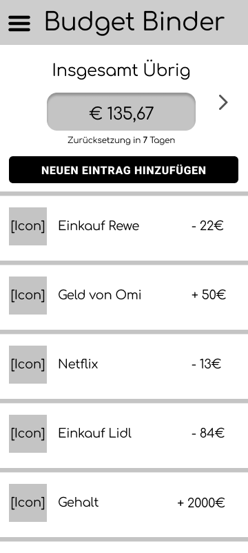|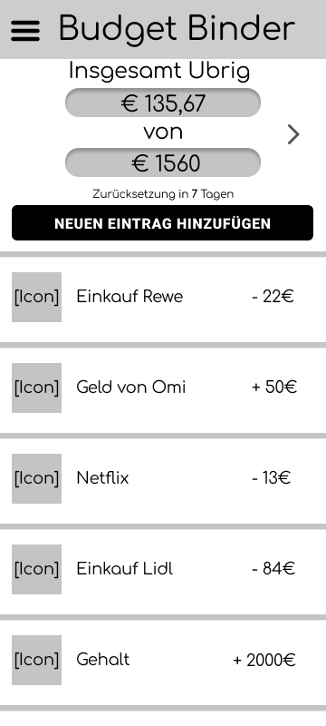|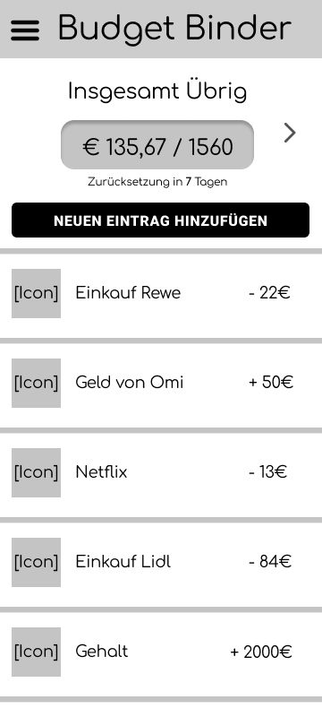|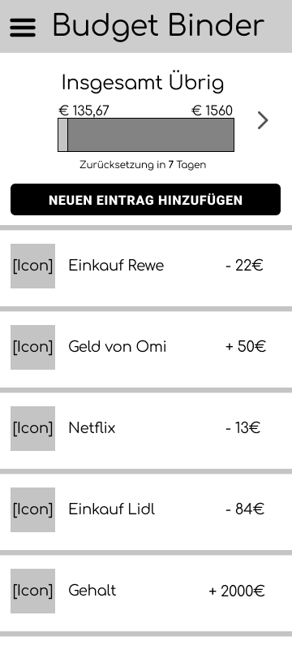|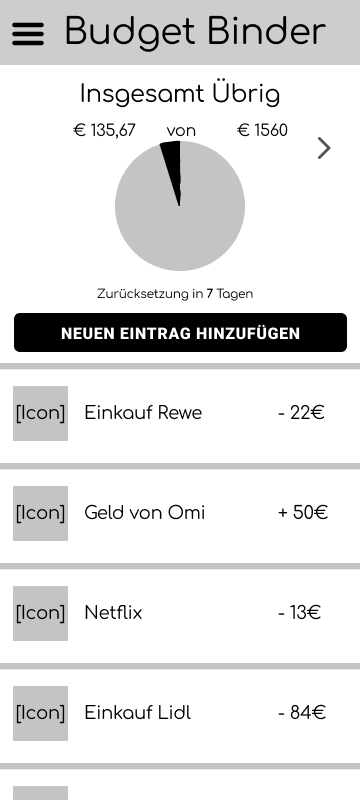|
|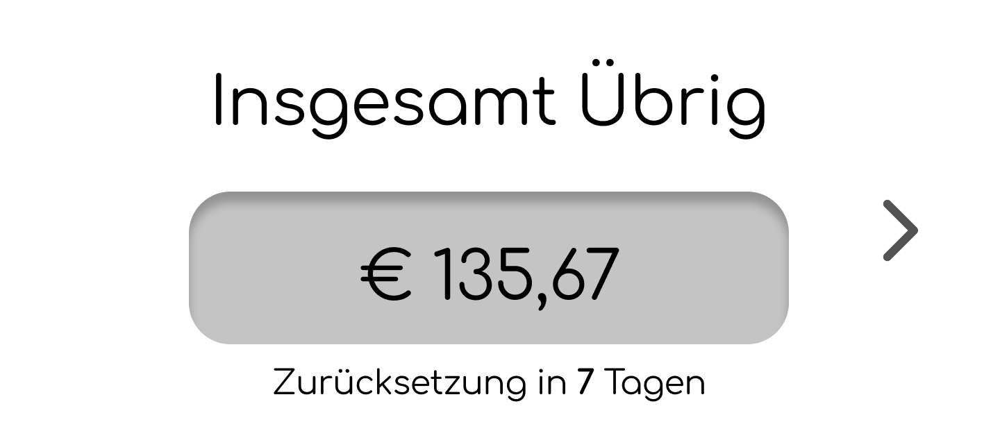|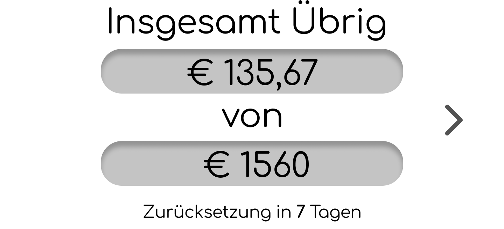|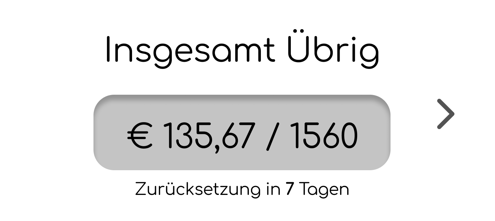|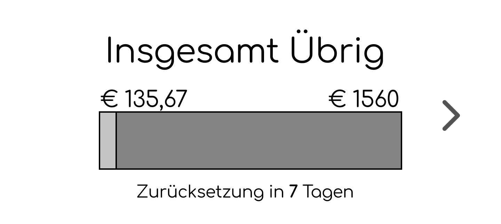|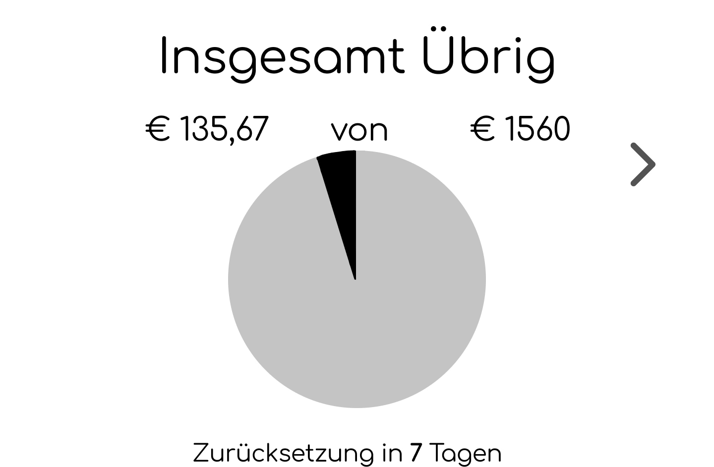|
| 
 **1** 
 | 
 **2** 
 | 
 **3** 
 | 
 **4** 
 | 
 **5** 
 |

### Frage 2

Welche der beiden Farbpaletten passen besser zu unserem Projekt?

| 1 | 2 |
|---|---|
|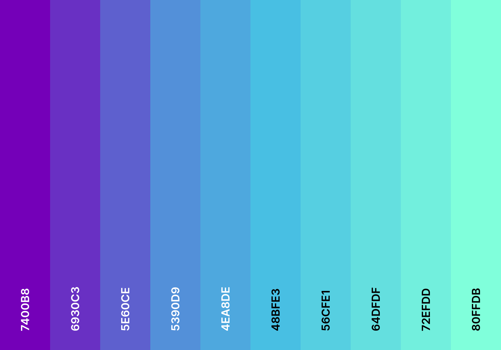|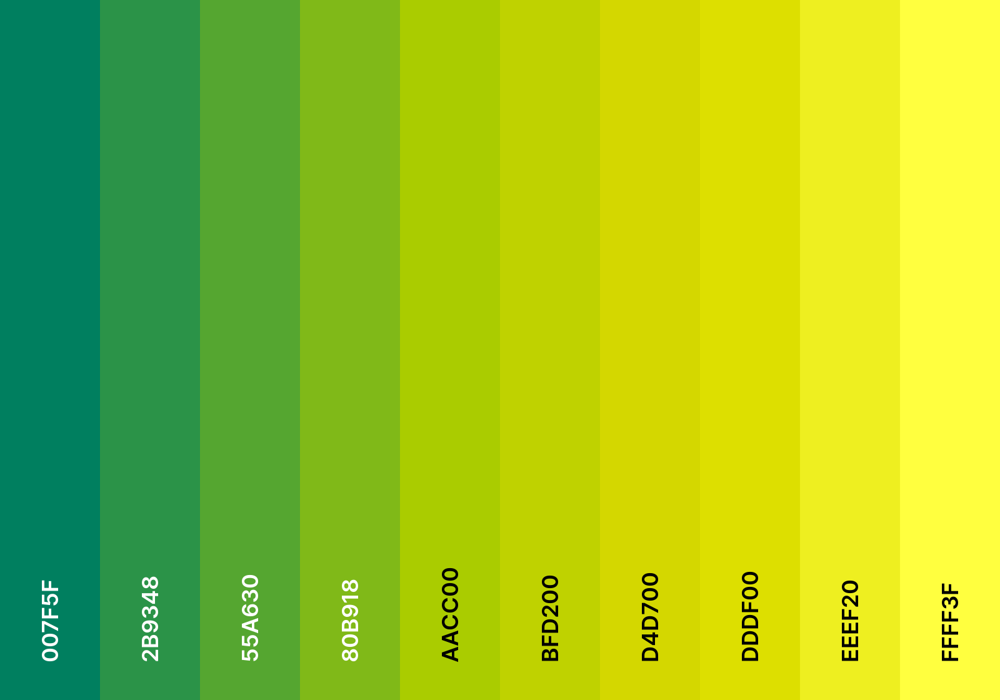|
